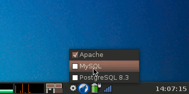
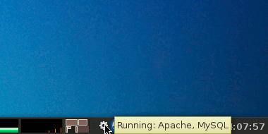

daemones
========

**dæmonēs** (the Latin for *daemons*) is a small GTK utility that sits
in your GNOME system tray (notification area) and allows you to start and stop daemons (web server,
database server,...) with a single click. You can configure what daemons will show up in the
menu and set the commands needed to start/stop them.

Installation & Usage
--------------------

1. Put the `daemones.py` script somewhere on your `$PATH` (`~/bin`, for instance).
2. Edit the included `example-config` file to create your configuration and save it as `~/.daemones`.
3. Optional: you may change the config file location and the status icon by editing the `CONFIG` and `ICON` variables at the top of `daemones.py`.
4. Ensure that `daemones.py` is started when you log in to GNOME. Adding it to `System -> Preferences -> Startup Applications` is a good choice.

You will probably need to ensure proper privilege escalation to start and stop system daemons. See the mini-HOWTO
in `privilege-escalation.txt` for tips.

Requirements
------------

* 2.5 &le; Python &lt; 3.0
* 2.10 &le; PyGTK
